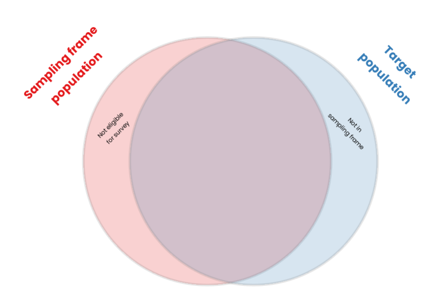

# Understanding Sample {#sample}

## What is a sample?

The question in the section title is easy to answer: **A sample is a subset of a population.** Now, what is a population? Well, a population is defined in the planning stage of a study and is determined by study objectives. We can visualize a population using the following table:

Member/Item/Unit ID | Var$_1$ | Var$_2$ | $\cdots$ | Var$_m$
:---------|:-------|:-------|:----------|:-------
 1        |        |        |           |
 2        |        |        |           |
 $\vdots$ |        |        |           |
 $N$      |        |        |           |

So essentially **a population is a list of members/items with associated characteristic variables that are of interest to the study.** 
However, when it comes to the finer details of the population concept, things become more complicated. Following Lohr (2022), we distinguish three populations, namely, ***target population***, ***sampling frame population*** and ***sampled population***. We **define** target population; if we can **create** a sampling frame---this is often the case---then we **have** the sampling frame population; we can ***study/analyze*** sampled population, but we never sure about what exactly the sampled population is.  

In Figure 1, we draw a Venn diagram to show sampling frame population and target population.

 

Let's have an example.

- Target population: all private dwellings in New Zealand.
- Sampling frame population: address list purchased from New Zealand Post.
- Not eligible for survey: some non-private dwellings, e.g. a prison.
- Not included in sampling frame: some new private dwellings not included in NZ Post system.
<!-- - Not reachable: e.g. some private dwellings in certain islands are too costly to be visited. -->

## What is a good sample?

According to Lohr (2010, p. 3), "a good sample will be representative in the sense that characteristics of interest in the population can be estimated from the sample with a known degree of accuracy." According to Lohr (2022, p. 3), "a sample is representative if it can be used to 'reconstruct' what the population looks like---and if we can provide an accurate assessment of how good that reconstruction is."
So a good sample should meet the following requirements:

1. No serious over and under *coverage issues*, that is, the sampling frame population should be sufficiently close to the target population.
1. No serious *selection bias issue*.
1. *Measurement and processing errors* are negligible. 

If the "soup" (a metaphor for the population) is not well mixed before we take a sample from it, then the sample cannot be good. Even if the "soup" is well mixed, selection bias may still happen because of e.g. *biased sampling frame* or *biased response*. By a biased sampling frame, we mean for whatever reasons the sampling frame excludes a subset of the population, resulting in discrepancy between it and the target population. That's why we are concerned about coverage issues---under coverage may cause serious selection bias. By *biased response*, we mean the responding sample is not representative. At survey operational level, we monitor *response rate*. If response rate is low, we worry that we may get biased response. If response rate is very low, say 20% or even lower, then we **suspect** that the sample is suffering response bias.

We omit details about measurement/processing errors here and refer readers to Lohr (2010), but we want to emphasize a point: **There are many practical factors to consider in any sample survey.**

## On sampling error

In the last Section, we mentioned coverage issue, selection bias, measurement and processing issues---these are all in the scope of *non-sampling error*. The flip side of the coin is *sampling error*, which is resulted from difference between a sample and the population in terms of characteristic variables. **Sampling error is unavoidable!** 

Let's have a toy example. The population is shown below.

Unit_ID | $Y$
:-------| :------
  1| 6
  2| 7
  3| 8
  4| 1
  5| 5
  
We can list all the 10 possible samples of size 3 by collecting the ID's:
$$
\{1, 2, 3\}, \ \{1, 2, 4\}, \ \{1, 2, 5\}, \ \{1, 3, 4\}, \ \{1, 3, 5\}
$$
$$
\{1, 4, 5\}, \ \{2, 3, 4\}, \ \{2, 3, 5\}, \ \{2, 4, 5\}, \ \{3, 4, 5\}
$$
The mean of $Y$ (or population mean) is
$$
\mu = \frac{6+7+8+1+5}{5}=\frac{27}{5}.
$$
The 10 sample means are: 7, 14/3, 6, 5, 19/3, 4, 16/3, 20/3, 13/3, and 14/3, respectively. When we use one of the sample means to estimate the population mean, we expect that our estimate is away from the truth---this shows sampling error. 

We often use *mean square error* (MSE) or *standard mean square error* (SMSE) to measure sampling error.
$$
\hbox{MSE}=\hbox{average of}\ (\hat{\theta}-\theta)^2\ \hbox{over all possible samples},
$$
where $\theta$ is the population parameter (e.g. population mean $\mu$) and $\hat{\theta}$ is a sample estimator (e.g. sample mean $\hat{\mu}$).
$$
\hbox{SMSE}=\sqrt{\hbox{MSE}}.
$$
It can be shown that 
$$
\hbox{MSE}= \hbox{var}(\hat{\theta}) + \left(\hbox{bias}(\hat{\theta})\right)^2,
$$
where 
$$
\hbox{var}(\hat{\theta})=\hbox{average of}\ \left(\hat{\theta}-\hbox{avg}(\hat{\theta})\right)^2\ \hbox{over all possible samples}
$$
and
$$
\hbox{bias}(\hat{\theta})=\hbox{avg}(\hat{\theta})-\theta,
$$
in which 
$$
\hbox{avg}(\hat{\theta})=\hbox{average of}\ \hat{\theta}\ \hbox{over all possible samples.}
$$
By the way, if
$$
\hbox{bias}(\hat{\theta})=0
$$
then we say that $\hat{\theta}$ is an **unbiased** estimator.

For the toy example above, 
$$
\hbox{MSE}=\frac{(7-27/5)^2+(14/3-27/5)^2+\cdots+(14/3-27/5)^2}{10}=0.973,
$$
and 
$$
\hbox{SMSE}=\sqrt{\hbox{MSE}}=0.987.
$$

The MSE (or SMSE) is only useful in **theoretical evaluation** of a sampling method. In practice, people are concerned about $\hbox{bias}(\hat{\theta})$ and $\hbox{var}(\hat{\theta})$. So we must have good estimates of $\hbox{bias}(\hat{\theta})$ and $\hbox{var}(\hat{\theta})$. If we have sound reasons to believe that 
$$
\hbox{bias}(\hat{\theta})=0,
$$
then we focus our attention on estimate of $\hbox{var}(\hat{\theta})$. A *confidence interval* can be constructed if $\hat{\theta}$ value and estimate of $\hbox{var}(\hat{\theta})$ are ready.

For the toy example, for each possible sample we calculate
$$
s^2=\frac{1}{n-1}\sum_{i=1}^n (y_i-\bar{y})^2,
$$
where $n=3$, $\{y_1, \ldots, y_n\}$ consists of the sample and $\bar{y}$ is the sample mean (i.e. an observed $\hat{\mu}$).
Let us use 
$$
\sqrt{\left(1-\frac{n}{N}\right)\frac{1}{n}s^2,}
$$
where $N=5$, to estimate $\sqrt{\hbox{var}(\hat{\mu})}$; the estimate is denoted by $\hat{\sigma}$. We set confidence interval using the following formula:
$$
(\hat{\mu} - 3\times \hat{\sigma},\  \hat{\mu} + 3\times \hat{\sigma});
$$
we can find that nine out of the ten resulted confidence intervals do contain the truth $27/5$. 

Table: (\#tab:unnamed-chunk-2)Toy example -- 10 possible samples and confidence intervals.

|  y_bar   |    s2     |   sigma   | lower_limit | upper_limit | indi |
|:--------:|:---------:|:---------:|:-----------:|:-----------:|:----:|
| 4.000000 | 7.000000  | 0.9660918 |  1.1017247  |  6.898275   |  1   |
| 4.333333 | 9.333333  | 1.1155467 |  0.9866932  |  7.679973   |  1   |
| 4.666667 | 12.333333 | 1.2823589 |  0.8195899  |  8.513744   |  1   |
| 4.666667 | 10.333333 | 1.1737878 |  1.1453033  |  8.188030   |  1   |
| 5.000000 | 13.000000 | 1.3165612 |  1.0503165  |  8.949684   |  1   |
| 5.333333 | 14.333333 | 1.3824294 |  1.1860451  |  9.480622   |  1   |
| 6.000000 | 1.000000  | 0.3651484 |  4.9045549  |  7.095445   |  1   |
| 6.333333 | 2.333333  | 0.5577734 |  4.6600133  |  8.006653   |  1   |
| 6.666667 | 2.333333  | 0.5577734 |  4.9933466  |  8.339987   |  1   |
| 7.000000 | 1.000000  | 0.3651484 |  5.9045549  |  8.095445   |  0   |

NB: Here is a quick explanation about "nine out of the ten resulted confidence intervals do contain the truth".

$$
\begin{array}{cl}
& \hbox{Pr}(|\hat{\mu} - \mu| < 3\hat{\sigma})\\
\approx & \hbox{Pr}(|t_2| < 3)\\
= & 0.905\ \hbox{(keeping three decimal places)}
\end{array}
$$
where $t_2$ is a random variable having $t$ distribution with 2 degrees of freedom.

<!-- ## Why take a sample? -->

<!-- A quick answer is: -->

<!-- - We want to save costs (such as money and time). -->
<!-- - In some situations, e.g. *blood testing*, we must take a sample rather than do a **census.** -->
<!-- - "Estimates based on sample surveys are often more accurate than those based on a census because investigators can be more careful when collecting data." (Lohr, 2019) -->
